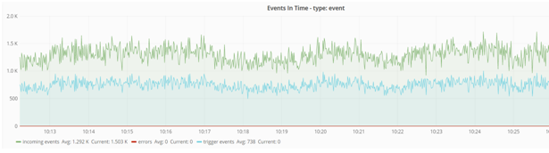
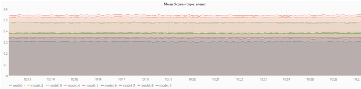

# Visualisation - EVE Metrics #
### How it works ###
To perform visualization, the Event Engine needs **influxDB** and **grafana** (tested on influxDB 1.1.1 and grafana 4.0.2 versions) or **Power BI**. Metrics are passed to **influxDB** by **EVE\_Core** application, and then they are visualized by **grafana**. All requests processed by **EVE\_Core** in specified time are passed to **Metric Processor**, that counts statistics and saves them in **influxDB** database. **EVE\_Core** passes a JSON request, JSON response, clientId and request type to the **Metric Processor**. In **grafana**, **influx** is defined as **DataSource**, from which metrics are downloaded. **EVE\_Core** do not connect with **grafana**.

### Configuration ###
**Influx** parameters are defined in **EVE\_Core** config file, as well as other parameters for metrics. 

List of parameters:

- **metrics\_destination** - INFLUX\_DB if statistics will be sent to influx, POWER\_BI if statistics will be sent to Power BI, NONE if statistics will not be counted
- **influx\_db\_url** - url address of influx, for example: http://127.0.0.1:8086
- **influx\_db\_user** - user name
- **influx\_db\_password** - user password
- **influx\_db\_database** - database name
- **influx\_db\_retention\_policy** - how long the inputs will be stored (see [influxDB documentation](https://docs.influxdata.com/influxdb/v0.9/query_language/database_management/#retention-policy-management))
- **custom\_request\_fields** - fields from an incoming event used as grouping in metrics' values aggregation
- **metric\_processed\_times** - defines how often the number of events occured will be counted
- **metric\_time\_window** - defines how often metrics will be sent to influx, defined in seconds
- **aggregate\_time\_window** - used by MeanScoreMetric, counts average value of score in given time window, defined in seconds (can't be less then metric\_time\_window)
- **max\_metric\_calculation\_threads** - maximum number of threads used to count metrics. The number of threads is set by the number of calculated metrics, but can't be bigger then maximum number of threads.
- **event\_request\_metrics** - metrics names for events of EVENT type, available metrics:
	- MeanScoreMetric
	- ProcessedRequestsMetric
	- WinPrcMetric
	- BidPrcMetric
- **profile\_request\_metrics** - metrics names for events of PROFILE type

### Available metrics ###
#### Processed Requests Metric ####
This metric presents the number of processed requests in specified time window (defined as **metric\_time\_window** parameter), including the number of incorrect requests and scored request. Statistics are aggregated per clientId and fields defined in **custom\_request\_fields**.

Fields in JSON send to grafana (influx name: processed\_requests, all fields are numeric):

- processed
- processed_time_[number from config]
- scored
- errors
- min_time
- max_time
- mean_time
- sum_time

#### Mean Score Metric ####
This metric presents mean score for every clientId and modelId and fields defined in **custom\_request\_fields**.Time window is defined in **aggregate\_time\_window**, with shift defined in **metric\_time\_window** parameter.

In programmatic, a suggested bidding price is returned instead of score.

Fields in JSON send to grafana (influx name: score, all fields except of modelId are numeric):

- min_score
- max_score
- mean_score
- sum_score
- scores_count
- modelId (text)

#### WinPrcMetric* ####
WinPrcMetric - price paid for a won view

Fields in JSON send to grafana (influx name: win\_prc, all fields are numeric):

- min\_win\_prc
- max\_win_prc
- mean_win\_prc
- sum_win\_prc
- count\_win\_prc

#### BidPrcMetric* ####
BidPrcMetric - bidded price (from bid response)

Fields in JSON send to grafana (influx name: bid\_prc, all fields are numeric):

- min\_bid\_prc
- max\_bid_prc
- mean_bid\_prc
- sum_bid\_prc
- count\_bid\_prc

*(Metrics only used in programmatic)
